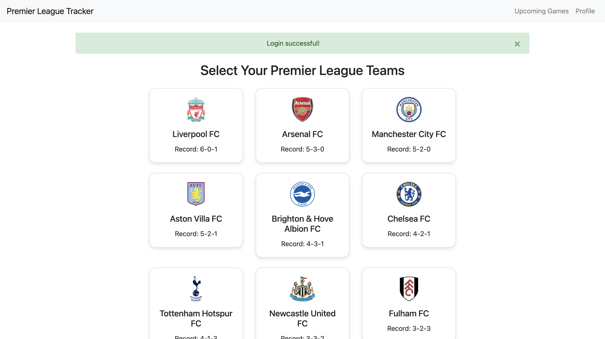
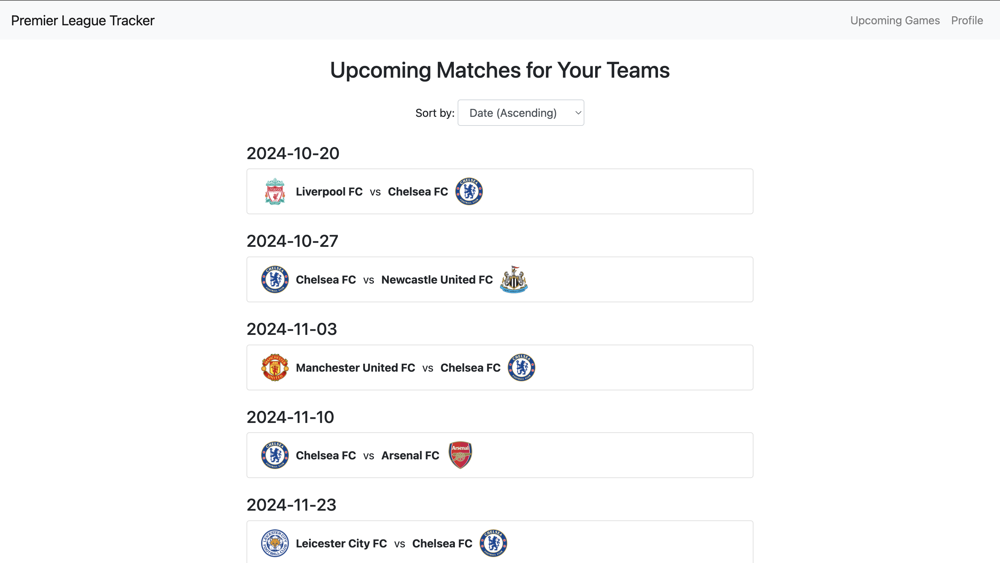
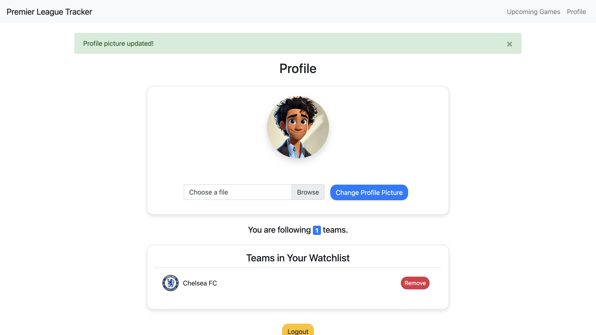

# Setup 
How to set up my Flask project locally.
## Prerequisites
- Python 3.6 or higher
- pip
## Installation
1. Create a new directory
```bash
mkdir aman_project
```
2. Change to the directory
```bash
cd aman_project
```
3. Clone the repository inside the newly created directory
```bash 
git clone <git_repo>
```
4. Create python venv
```bash
python -m venv venv
```
or
```bash
python3 -m venv venv
```
5. Source the venv
```bash
source venv/bin/activate
```
or (for Windows)
```bash
venv\Scripts\activate
```
6. Install all the items in requirements.txt
```bash
pip install -r requirements.txt
```
7. Initialize and create the PostgreSQL database (Schema is inside stock_whisperers_schema.sql)
```sql
CREATE DATABASE uspc_server;

CREATE TABLE IF NOT EXISTS users (
    user_id SERIAL,
    first_name VARCHAR(255) NOT NULL,
    last_name VARCHAR(255) NOT NULL,
    username VARCHAR(255) UNIQUE NOT NULL,
    password VARCHAR(255) NOT NULL,
    profile_picture VARCHAR(255), 
    PRIMARY KEY (user_id)
);
CREATE TABLE IF NOT EXISTS soccer_teams (
    team_id SERIAL,
    team_name VARCHAR(255) NOT NULL,
    wins_draws_losses VARCHAR(50),
    logo VARCHAR(255),
    PRIMARY KEY (team_id)
);

CREATE TABLE IF NOT EXISTS user_watchlist_teams (
    user_id INT REFERENCES users(user_id),
    team_id INT REFERENCES soccer_teams(team_id),
    PRIMARY KEY (user_id, team_id)
);
```
8. Create items in the .env (Use your DB information for 1-5. Create an API key from https://www.football-data.org/ for 6.)
```.env
DB_USER = <YourDBUserName> 
DB_PASS = <YourDBPassword>
DB_HOST = <YourDBHost>
DB_PORT = <YourDBPort>
DB_NAME = <YourDBName>
API_KEY = <YourAPIKey>
SECRET_KEY = 123456
```
9. Run the final Flask web application
```bash
flask run
```
10. Navigate to http://127.0.0.1:5000 and you should see the web application running
11. Sign up and log in to see the full functionality of the web application

## Demo



*Screenshot of the home page interface.*



*Screenshot of the upcoming page interface.*



*Screenshot of the profile page interface.*
